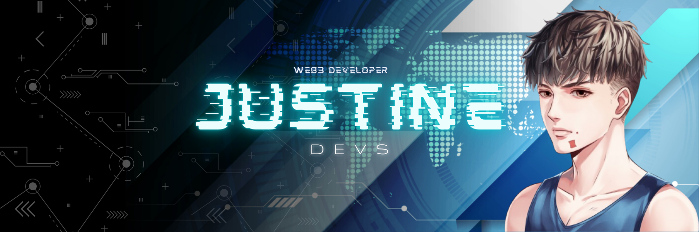

<div align="center">



</div>

## Overview

I am Justine, a software developer specializing in blockchain and web technologies with a strong portfolio of projects. As a Solidity developer in a 3-member team, I contributed to building **HyperionKit** - a developer infrastructure toolkit. Despite being a beginner in smart contracts, I learned through collaborative coding and helped achieve our first hackathon victory!

My experience covers front-end projects, responsive web apps, user authentication systems, advanced crypto trading automation, and decentralized governance tools.

Since 2022, I have been an active Web3 community moderator and professional moderator, evolving from volunteer roles to paid projects. I'm a strong problem solver and communicator, aiming to expand client-facing and IT infrastructure skills.

## Table of Contents

- [Getting Started](#getting-started)
- [Project Structure](#project-structure)
- [Pages](#pages)
- [Skills & Technologies](#skills--technologies)
- [Projects](#projects)
- [Experience](#experience)
- [Community Involvement](#community-involvement)
- [Contact](#contact)

## Getting Started

This portfolio is built with Next.js 14, TypeScript, and Tailwind CSS.

### Prerequisites

- Node.js 18.0 or higher
- npm 8.0 or higher

### Installation

1. **Install dependencies**
   ```bash
   npm install
   ```

2. **Run development server**
   ```bash
   npm run dev
   ```

3. **Open your browser**
   Navigate to [http://localhost:3000](http://localhost:3000)

### Build for Production

```bash
npm run build
npm start
```

## Project Structure

```
├── app/                    # Next.js app directory
│   ├── layout.tsx         # Root layout
│   ├── page.tsx           # Landing page
│   ├── about/             # About page
│   ├── experience/        # Experience page
│   └── projects/          # Projects pages
├── components/            # React components
│   ├── sections/          # Page sections
│   ├── Navbar.tsx         # Navigation component
│   ├── Footer.tsx         # Footer component
│   └── PreLoading.tsx     # Loading screen
├── public/                # Static assets
└── JSON.md                # Design specifications
```

## Pages

- **Landing Page** (`/`) - Hero section, tech stack, featured projects, activity heatmap
- **About Page** (`/about`) - Story, responsibilities, strengths, vision
- **Experience Page** (`/experience`) - Career timeline, gallery, testimonials
- **Projects Page** (`/projects`) - Project grid showcase
- **Project Showcase** (`/projects/[slug]`) - Individual project details

## Skills & Technologies

### Blockchain & Web3
- **Solidity** - Smart contract development
- **Web3.js / Ethers.js** - Blockchain interactions
- **Decentralized Applications (DApps)** - Full-stack DApp development
- **Smart Contract Auditing** - Security best practices

### Frontend Development
- **Responsive Web Design** - Mobile-first approach
- **User Authentication Systems** - Secure authentication flows
- **Modern JavaScript/TypeScript** - ES6+ and TypeScript
- **React/Next.js** - Component-based UI development

### Automation & Tools
- **Crypto Trading Automation** - Advanced trading bot development
- **Decentralized Governance Tools** - DAO and governance systems
- **Developer Infrastructure** - Tooling and infrastructure development

### Soft Skills
- **Problem Solving** - Analytical thinking and debugging
- **Communication** - Clear technical and non-technical communication
- **Collaboration** - Team-based development experience
- **Community Management** - Web3 community moderation

## Projects

### HyperionKit 🏆
**Developer Infrastructure Toolkit** | *Hackathon Winner*

- Contributed as a Solidity developer in a 3-member team
- Built developer infrastructure toolkit for blockchain development
- Achieved first hackathon victory through collaborative coding
- Gained hands-on experience in smart contract development

### Additional Projects
- **Front-end Applications** - Responsive web applications with modern UI/UX
- **User Authentication Systems** - Secure authentication and authorization
- **Crypto Trading Automation** - Advanced automated trading systems
- **Decentralized Governance Tools** - DAO governance and voting mechanisms

## Experience

### Web3 Community Moderator (2022)
- Active community moderator since 2022
- Evolved from volunteer roles to paid professional projects
- Managed and engaged with Web3 communities
- Facilitated discussions and provided technical support

### Software Developer
- Specialized in blockchain and web technologies
- Full-stack development experience
- Collaborative team development
- Continuous learning and skill expansion

## Community Involvement

- Active Web3 community member and moderator since 2022
- Professional moderation services for blockchain projects
- Community engagement and technical support
- Knowledge sharing and mentorship

## Contact

Connect with me through:
- **Portfolio Website**: [View Live Site](#)
- **GitHub**: [@JustineDevs](https://github.com/JustineDevs)
- **Email**: [JustineLupasi180@gmail.com](mailto:JustineLupasi180@gmail.com)

---

<div align="center">

**Built with ❤️ by JustineDevs**

</div>